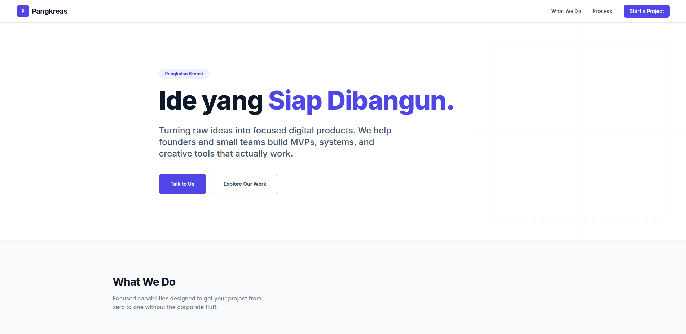

# Pangkreas Landing Page

A modern landing page for Pangkreas.

# Pangkreas Landing Page

A modern, responsive landing page for Pangkreas built with performance and SEO best practices in mind.



## Features

- **Responsive Design** - Optimized for all device sizes
- **High Performance** - Fast load times and smooth interactions
- **SEO Optimized** - Built-in SEO best practices
- **Modern Stack** - Built with the latest web technologies

## Getting Started

### Prerequisites

- Node.js 14 or higher
- npm or yarn package manager

### Installation

```bash
npm install
```

### Development

```bash
npm run dev
```

### Production Build

```bash
npm run build
```

## Project Structure

```
src/
├── components/     # Reusable UI components
├── pages/          # Page components
└── styles/         # Global and component styles
```

## Contributing

Contributions are welcome. Please submit pull requests to the main branch.

## License

MIT License - See LICENSE file for details
